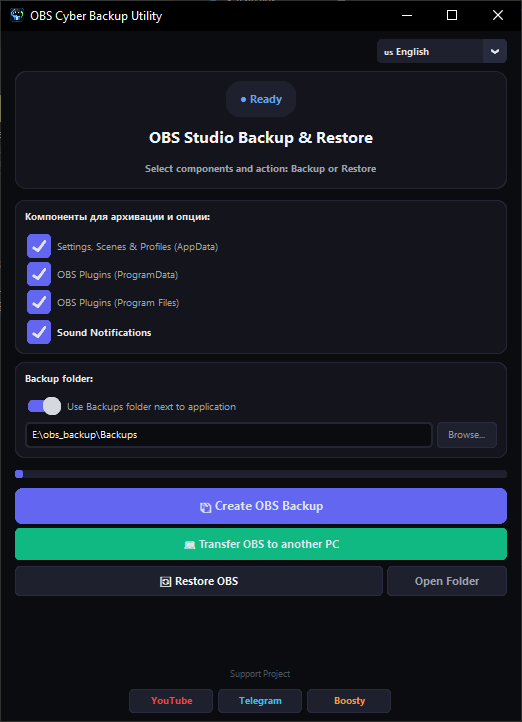

# 📦 OBS Cyber Backup Utility

**OBS Cyber Backup Utility** is a lightweight Windows utility for backing up and restoring **OBS Studio** settings, scenes, profiles, and installed plugins.

The application is designed for situations where you need to preserve your working OBS configuration before reinstalling Windows, moving OBS to another computer, or making major system changes.

> ⚠️ **OBS Studio must be closed before starting a backup or restore operation.**

## 🖼️ Screenshot



## ✨ Features

* 📦 Create a complete OBS Studio backup as a ZIP archive
* 🔄 Restore settings from a ZIP backup
* 🎬 Back up OBS scenes, profiles, and settings
* 🔌 Back up OBS plugins
* ☑️ Select which components to include in the backup
* 🛡️ Verify the created ZIP archive after the backup is completed
* 📋 Generate `backup_info.json` containing backup information
* 🔍 Validate the selected archive before restoring
* 🚫 Check whether OBS Studio is currently running
* 📊 Display operation progress
* 🔊 Play a sound notification after a successful operation
* 📝 Automatically create application logs
* 🌐 Russian and English interface
* 💾 Save application settings
* 🖥️ Support for both Python source execution and a prepared Windows build

## 🗂️ What Can Be Backed Up

The application allows you to select the following components separately:

### AppData

OBS Studio user settings, scenes, and profiles:

```text
%APPDATA%\obs-studio
```

### ProgramData

OBS Studio plugins:

```text
%PROGRAMDATA%\obs-studio\plugins
```

### Program Files

System-installed OBS Studio plugins:

```text
C:\Program Files\obs-studio\obs-plugins
```

This allows you to create either a **complete OBS backup** or save only the components you need.

## 📦 Backup Format

Backups are created in:

```text
ZIP
```

The archive also contains:

```text
backup_info.json
```

This file stores information about the utility version, backup creation time, number of files, and selected components.

Example:

```json
{
    "app": "OBS Cyber Backup Utility",
    "version": "1.1.0",
    "created": "2026-09-29 14:00:00",
    "total_files": 123,
    "appdata_obs": true,
    "programdata_plugins": true,
    "programfiles_plugins": true
}
```

## 🔐 Backup Verification

After creating a ZIP archive, the application automatically verifies its contents.

If the archive is corrupted or cannot be read correctly, the operation is considered unsuccessful.

When restoring a backup, the selected archive is also checked before the restoration process begins.

## 🚨 Restore Safety

Before restoring a backup, the application checks:

* whether OBS Studio is running;
* whether the selected file is a valid ZIP archive;
* whether backup information is present;
* whether the archive contents can be read correctly;
* whether the required Windows directories are writable.

If OBS Studio is running, the application will ask you to close it first.

> ⚠️ **Administrator privileges may be required** to modify files in protected Windows system directories.

## 💻 Move OBS to Another Computer

The application includes a dedicated **"Move OBS to Another PC"** function that helps you use an existing backup to transfer your OBS configuration to another computer.

The general process:

```text
Old PC
   │
   ├── OBS Studio
   ├── Scenes
   ├── Profiles
   └── Plugins
          │
          ▼
      ZIP Backup
          │
          ▼
       New PC
          │
          └── Restore
```

This makes it easier to move your existing OBS environment without manually copying individual folders and files.

## 📝 Logs

The application automatically creates a:

```text
logs
```

folder when necessary.

Daily log files are stored using the following format:

```text
app_YYYY-MM-DD.log
```

Logs can help identify the cause of an error if a backup or restore operation fails.

## 🔊 Completion Notification

After successfully creating a backup, the application plays a sound notification.

This can be especially useful when working with a large number of scenes, profiles, and plugins, where creating the archive may take some time.

## 🖥️ Interface

The application uses a modern dark interface built with **CustomTkinter**.

Main interface features include:

* language selection;
* backup component selection;
* backup folder selection;
* progress indicator;
* backup creation;
* backup restoration;
* opening the backup folder;
* moving OBS to another computer.

## ⚙️ Requirements

To run the source code, you need:

* Windows 10/11
* Python 3.x
* CustomTkinter

Install the required dependency:

```bash
pip install customtkinter
```

## ▶️ Running from Source

Clone the repository:

```bash
git clone https://github.com/YOUR_USERNAME/OBS-Cyber-Backup.git
cd OBS-Cyber-Backup
```

Run the application:

```bash
python "obs_cyber_backup.py"
```

If the Python file has a different name, use the current filename provided in the repository.

## 📁 Project Structure

Example project structure:

```text
OBS-Cyber-Backup/
│
├── obs_cyber_backup.py
├── alert.wav
├── README.md
├── LICENSE
│
├── Backups/
│
└── logs/
```

The `Backups` and `logs` folders are created automatically by the application when needed.

## 🛠️ Version

Current version:

**v1.1.0**

### What's New in v1.1.0

* Added a check for whether OBS Studio is running
* Added backup metadata
* Added ZIP verification after backup creation
* Added archive validation before restoration
* Added component selection
* Added application logging
* Added an extended error window
* Added completion sound notifications
* Added a helper function for moving OBS to another computer

## ⚠️ Important

The application works directly with OBS Studio directories.

Before restoring a backup, it is recommended to create a separate copy of your current OBS configuration.

Special care should be taken when restoring plugins, as different versions of OBS Studio and third-party plugins may not be compatible with each other.

This application does not replace the standard Windows backup tools. It is specifically designed to make backing up and restoring an **OBS Studio configuration** easier.

## ❤️ Support the Project

If you find the application useful and would like to support further development:

* YouTube: **Cyber Craft**
* Telegram: **CyberCraftLab**
* Boosty: **Cyber Craft**

---

## 📜 License

This project is distributed under the license specified in the [`LICENSE`](LICENSE) file.

If the repository uses the **MIT License**, add a `LICENSE` file containing the full MIT License text.
